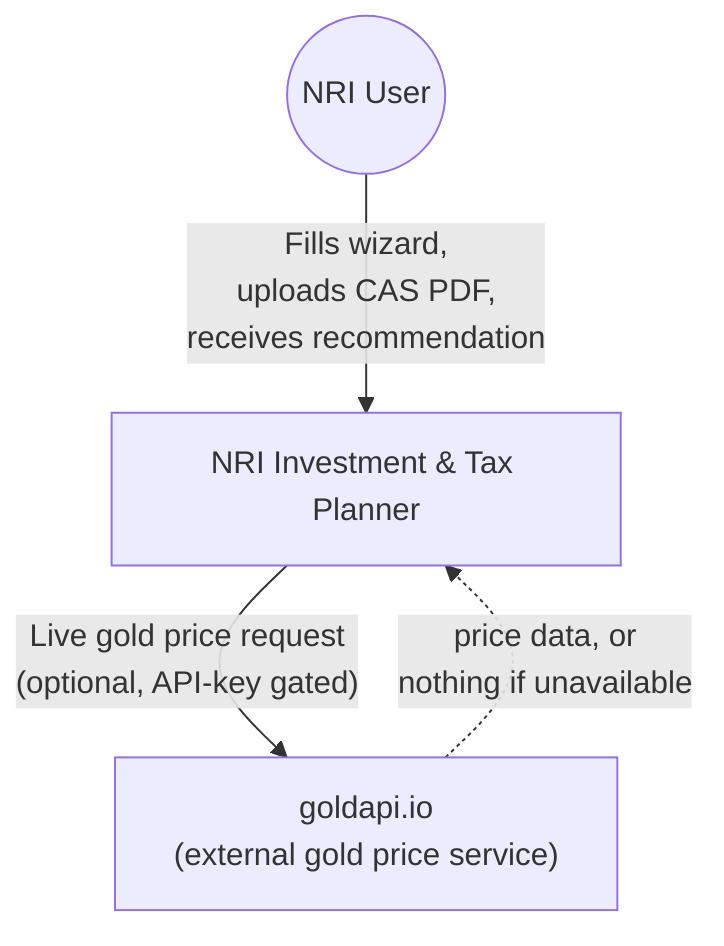
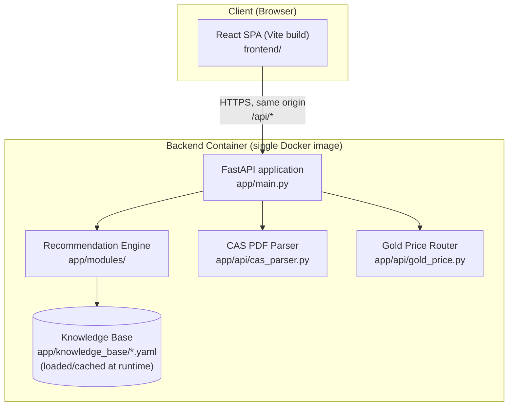
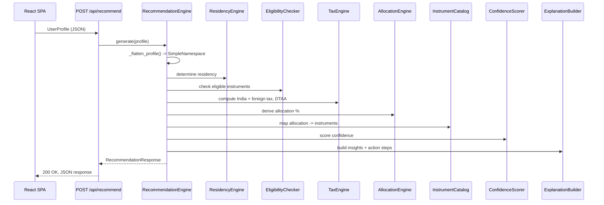
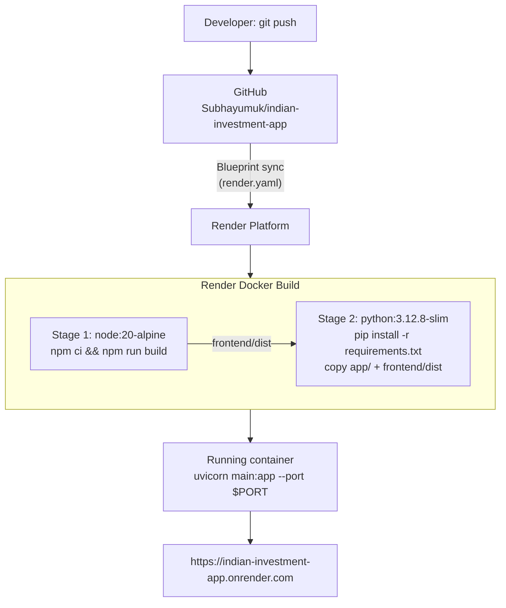

# NRI Investment & Tax Planner — Architecture Document

| | |
|---|---|
| **Document type** | Architecture Overview, High-Level Design (HLD) & Solution Design |
| **System** | NRI Investment & Tax Planner (`indian-investment-app`) |
| **Version** | 1.0 |
| **Last updated** | 2026-08-26 |
| **Status** | Living document — kept in sync with `CLAUDE.md`; update on material architecture changes |
| **Audience** | Enterprise/Solution Architects, technical reviewers, future maintainers |

---

## 1. Executive Summary

This system produces deterministic, rules-based tax and investment
recommendations for Non-Resident Indians (NRIs) across nine jurisdictions
(India plus eight residence countries: Denmark, UAE, UK, USA, Singapore,
Canada, Germany, Australia). It is a two-tier web application — a React
single-page application (SPA) frontend and a Python/FastAPI backend — with
no database and no AI/LLM inference in the request path. All domain logic
(tax rates, eligibility rules, DTAA provisions) is externalized into
version-controlled YAML data files, making the system auditable and
updatable without code changes to the rule engine itself.

The system is currently a single-instance deployment (Render, Docker,
free tier) with no persistence layer, no authentication, and no
multi-tenancy — appropriate for its current stage (solo-developer learning
project transitioning toward a real personal-use tool) but with clearly
identified gaps before any production/multi-user posture (Section 11).

## 2. Business Context & Problem Statement

NRIs with financial ties to India face a two-jurisdiction tax and
investment-eligibility problem: what they can legally invest in, and how
it is taxed, depends on the interaction between India's FEMA/tax rules and
their country of residence's tax code and any India-DTAA (Double Taxation
Avoidance Agreement) in force. This is normally the domain of a paid
cross-border tax advisor. This system encodes that domain knowledge as
structured rules so an individual can self-serve a first-pass plan.

**Explicit non-goal:** this is not a substitute for professional advice.
The system generates disclaimers on every response (`disclaimer_generator.py`)
and is positioned as educational/planning output only.

## 3. Scope

**In scope:**
- Tax residency determination (India + 8 supported countries)
- Investment eligibility screening per residency
- India tax computation + foreign-country tax treatment + DTAA relief
- Risk/horizon-based asset allocation and instrument recommendations
- Best-effort ingestion of an existing portfolio via CAS (Consolidated
  Account Statement) PDF upload
- Indicative live gold price lookup

**Out of scope (current version):**
- User accounts, authentication, saved sessions
- Persistence of submitted financial data
- Any jurisdiction beyond the 9 currently modeled
- Automated tracking of tax-law changes (YAML files are manually maintained)

## 4. Stakeholders

| Stakeholder | Interest |
|---|---|
| End user (NRI individual) | Accurate, understandable, actionable plan |
| Solo developer/owner | Maintainability, learning value, low operating cost |
| Future reviewer (this document's audience) | Architectural soundness, identified risk, upgrade path |

## 5. High-Level Design (HLD)

### 5.1 System Context (C4 Level 1)

The system has exactly one external dependency (`goldapi.io`), and it is
non-critical: absence of an API key or a failed call falls back to a
hardcoded price (`app/api/gold_price.py`), so the core recommendation flow
has **zero hard external dependencies**.

### 5.2 Container Diagram (C4 Level 2)

**Key point for review:** there is no database container, no cache layer,
no message queue. The "Knowledge Base" is not a database — it is static
YAML shipped inside the same Docker image, loaded into memory
(`app/utils/kb_loader.py`, `lru_cache`d). This is a deliberate simplicity
choice appropriate to the current scale (see Section 9, Scalability).

### 5.3 Key Architectural Principles

1. **Deterministic over generative.** No LLM/AI call sits in the
   recommendation path. Every output is traceable to an explicit rule in a
   YAML file or a branch in Python code — auditable and reproducible by
   design, which matters for anything tax-adjacent.
2. **Rules as data, not code.** Country-specific tax/eligibility rules live
   in YAML (`app/knowledge_base/<country>/*.yaml`), not hardcoded in Python.
   Adding or correcting a rule is a data change, reviewable by a non-engineer
   domain expert, not a code change.
3. **Stateless request/response.** The backend holds no session state and
   persists nothing between requests (confirmed: no database, no file
   writes of user data anywhere in `app/`). Every `/api/recommend` call is
   fully self-contained.
4. **Single-origin deployment.** Frontend and backend ship as one Docker
   image, served from one origin — see Section 8.
5. **Fail-soft on non-critical paths.** Gold price lookup and CAS PDF
   parsing both degrade gracefully (hardcoded fallback; partial/failed
   parse status) rather than erroring the whole flow.

## 6. Solution Design

### 6.1 Component Design

| Component | Responsibility |
|---|---|
| `app/models/user_profile.py` (`UserProfile`) | Request contract: personal, financial, residency, investment-goal data |
| `app/models/recommendation.py` (`RecommendationResponse`) | Response contract: allocation, instruments, tax summary, compliance notes, projections, insights, action steps, disclaimers, confidence score |
| `app/modules/recommendation_engine.py` | Orchestrator; flattens the nested request into the flat shape the sub-engines expect, calls each in sequence, assembles the response |
| `app/modules/residency_engine.py` | Determines tax residency status (India + destination country) from the profile |
| `app/modules/eligibility_checker.py` | Filters which Indian investment products are legally available to this specific NRI |
| `app/modules/tax_engine.py` | Computes India-side tax, destination-country tax, and DTAA relief |
| `app/modules/allocation_engine.py` | Derives an asset allocation from stated risk tolerance and investment horizon |
| `app/modules/instrument_catalog.py` | Maps allocation categories to concrete instruments |
| `app/modules/confidence_scorer.py` | Scores how complete/reliable the input data was, surfaced to the user |
| `app/modules/explanation_builder.py` | Converts structured results into plain-language insights and action steps |
| `app/utils/kb_loader.py` | Loads and caches the YAML knowledge base |
| `app/utils/currency_converter.py` | INR/foreign-currency conversion helper |
| `app/utils/disclaimer_generator.py` | Generates the legal/educational disclaimers attached to every response |
| `app/api/cas_parser.py` | Best-effort extraction of holdings from an uploaded NSDL CAS PDF |
| `app/api/gold_price.py` | Live gold price with hardcoded fallback |

### 6.2 Core Sequence: Generate Recommendation

**Documented gotcha (relevant to code-review/maintenance risk):** the
`_flatten_profile` step converts several typed enums (`IndianResidentialStatus`,
`AccountType`, `InvestmentGoal`) into plain strings for the downstream
modules. On this Python version, `str(enum_member)` yields `"ClassName.MEMBER"`
rather than the member's value — three real bugs stemmed from exactly this
in the past (see `CLAUDE.md`, `tests/test_recommendation_engine.py`
regression tests). This is now covered by regression tests, but it is the
single most fragile point in the data-flow and worth flagging to any
reviewer extending `UserProfile` with new enum fields.

### 6.3 Data Model

- **Request** (`UserProfile`): nested Pydantic model — personal info,
  financial details, residency details, investment goals/risk profile.
- **Response** (`RecommendationResponse`): allocation percentages,
  concrete instrument list, tax summary (India + foreign + DTAA relief),
  compliance notes (FEMA), multi-year projections, key insights, action
  steps, disclaimers, and an overall confidence score.
- No data model is persisted; both are pure request/response DTOs.

### 6.4 Knowledge Base Design

`app/knowledge_base/` is organized one directory per country
(`india/`, `denmark/`, `uae/`, `uk/`, `usa/`, `singapore/`, `canada/`,
`germany/`, `australia/`), each holding one or more YAML rule files
(e.g. `india/nri_taxation.yaml`, `india/dtaa_provisions.yaml`,
`<country>/tax_rules.yaml`). `app/utils/kb_loader.py` loads and
`lru_cache`s these at process start. This design means:
- Rule corrections/updates ship as a data-only pull request.
- The rule engine's Python code doesn't need to understand every country's
  specifics — it consumes a common schema per rule type.
- There is currently **no schema validation layer** on the YAML beyond what
  `kb_loader.py`/consuming code implicitly expects — a malformed YAML edit
  would surface as a runtime error, not a caught data-validation error
  (flagged as a gap in Section 11).

### 6.5 API Surface

| Method | Path | Purpose |
|---|---|---|
| `GET` | `/api/health` | Liveness check (served by `app/routes/health.py`; a duplicate route in `recommendations.py` is dead code — Starlette's first-match routing always serves the `routes/health.py` version) |
| `POST` | `/api/recommend` | Core recommendation generation |
| `GET` | `/api/instruments` | Static reference list of investment instruments |
| `POST` | `/api/parse-cas` | Best-effort CAS PDF holdings extraction |
| `GET` | `/api/gold-price` | Current gold price (live or fallback) |
| `GET` | `/` (and all unmatched paths) | Serves the built React SPA (`StaticFiles`, mounted last as catch-all) |

## 7. Deployment Architecture

### 7.1 Deployment Diagram

### 7.2 CI/CD Flow

There is no separate CI pipeline (no GitHub Actions configured). Render's
Blueprint sync acts as a minimal CD mechanism: any push to `main` triggers
an automatic rebuild and redeploy. **There is no automated test gate before
deploy** — `pytest` is run manually/locally, not as a required check before
Render deploys a new push. This is a gap relative to a production posture
(Section 11).

### 7.3 Environments

Single environment: Render production, free tier. **No staging/preview
environment exists.** Every push to `main` deploys directly to the only
running instance.

## 8. Non-Functional Requirements

| Category | Current posture |
|---|---|
| **Security** | No authentication/authorization (system is single-user, no accounts). `GOLD_API_KEY` is the only secret, sourced from env var, never committed. CORS defaults to `*` (acceptable only because frontend and backend are single-origin in the deployed configuration; would need scoping if the frontend were ever split out). No PII is persisted — every request is processed and discarded in memory. |
| **Availability/Reliability** | Render free tier: single instance, no redundancy, no SLA. The instance sleeps after ~15 minutes idle and cold-starts (roughly a minute) on the next request. No documented recovery/rollback procedure beyond re-pushing a prior commit. |
| **Scalability** | Stateless request handling means horizontal scaling is architecturally straightforward if needed, but the current Render plan runs exactly one instance with no autoscaling configured. Knowledge-base YAML is loaded once per process and cached — negligible per-request overhead. |
| **Performance** | No LLM inference in the path — response time is dominated by Python rule evaluation (sub-second) plus network/cold-start latency, not model latency. |
| **Maintainability** | Rules are externalized to YAML (low-friction updates); 126 automated tests cover engine modules, API endpoints, and regression cases for the known enum-flattening bug class. No linter is configured for the Python side (frontend has `oxlint`). |
| **Cost** | $0/month on Render's free tier as currently configured (Docker build minutes are well within the free monthly allowance). |
| **Compliance/Disclaimer** | Every response includes generated disclaimers (`disclaimer_generator.py`) framing output as educational, not professional tax/legal/investment advice. |

## 9. Technology Stack & Rationale

| Layer | Choice | Rationale |
|---|---|---|
| Frontend | React 19 + Vite | Fast dev/build tooling; SPA fits a linear multi-step wizard well |
| Backend framework | FastAPI | Async-capable, automatic OpenAPI docs, first-class Pydantic integration for request/response validation |
| Data validation | Pydantic v2 | Strong typed request/response contracts, enum support |
| Rule storage | YAML + PyYAML | Human/domain-expert-editable, diffable in version control, no schema-migration overhead of a database |
| PDF parsing | pdfplumber | Handles NSDL CAS PDF text extraction without a paid OCR service |
| HTTP client (outbound) | httpx | Async-compatible, used for the gold-price call and in tests |
| Containerization | Docker (multi-stage) | Portable, reproducible builds; solves the "Render's Python runtime has no Node.js" constraint cleanly |
| Hosting | Render (Docker runtime) | Free tier suffices at current scale; Blueprint (`render.yaml`) gives declarative, version-controlled deploy config |

## 10. RAID Log (Risks, Assumptions, Issues, Dependencies)

| Type | Item | Impact / Mitigation |
|---|---|---|
| **Risk** | Single free-tier instance, no redundancy | Acceptable for personal use; would need a paid tier + multi-instance for any real availability guarantee |
| **Risk** | YAML tax rules are manually maintained with no change-detection against real law changes | Rules can silently go stale; mitigation would be a periodic manual review cadence, not currently formalized |
| **Risk** | No automated test gate in the deploy pipeline | A broken commit could deploy directly to production; mitigate by running `pytest` before every push (currently a manual discipline, not enforced) |
| **Risk** | No YAML schema validation | A malformed rule file fails at runtime, not at data-authoring time |
| **Assumption** | Users self-report accurate financial/residency data | No independent verification of any input; output quality is bounded by input honesty/accuracy |
| **Constraint** | No LLM/AI calls by design | Limits recommendations strictly to what is explicitly encoded in the knowledge base — cannot handle a jurisdiction or scenario not modeled |
| **Dependency** | `goldapi.io` (external, optional) | Non-critical — hardcoded fallback if unavailable or unconfigured |
| **Issue (known, non-blocking)** | `GET /health` defined twice (`app/routes/health.py` and `app/api/recommendations.py`); the second is unreachable dead code | Documented, covered by a test asserting the routing behavior; low priority to remove |

## 11. Known Technical Debt / Open Items

- Pydantic v2 `class Config` deprecation in `app/models/user_profile.py`
  (unfixed, harmless — will require a `ConfigDict` migration before
  Pydantic v3).
- `railway.toml` and `Procfile` are stale relative to the current Docker
  deploy approach — they still describe a native Python-only start command
  and would need to be pointed at the same `Dockerfile` (or removed) if
  Railway/Heroku-style hosting is ever actually used.
- `README.md` describes the deleted legacy single-country pipeline and is
  out of date relative to the current architecture described in this
  document and in `CLAUDE.md`.
- No staging environment, no CI test gate before deploy — both would be
  the first additions before any move toward multi-user or production use.
- No YAML schema validation for the knowledge base.

## 12. Appendix: Glossary

| Term | Meaning in this document |
|---|---|
| NRI | Non-Resident Indian — an Indian citizen/origin individual tax-resident elsewhere |
| DTAA | Double Taxation Avoidance Agreement — a treaty preventing the same income being taxed twice by two countries |
| FEMA | Foreign Exchange Management Act — Indian law governing cross-border financial transactions |
| CAS | Consolidated Account Statement — a single statement of all an investor's Indian mutual fund/demat holdings |
| C4 model | A standard notation for architecture diagrams at increasing zoom levels (Context, Container, Component, Code) — Sections 5.1/5.2 use Levels 1 and 2 |
| DTO | Data Transfer Object — a plain data structure used to move data between layers, with no persistence or behavior of its own |
