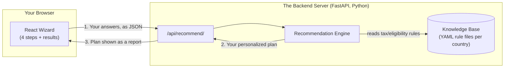
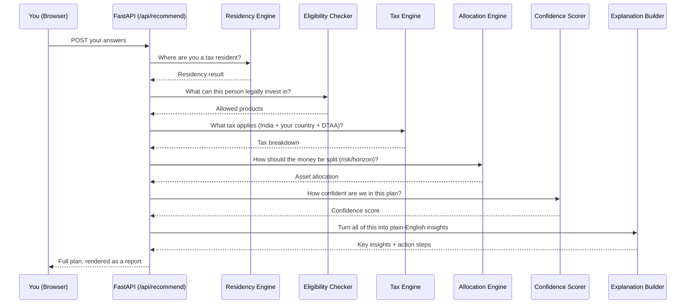
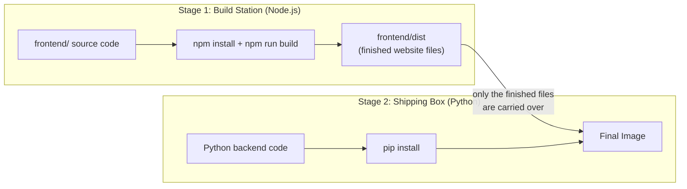
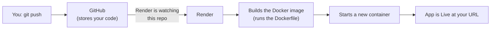

# How This App Works (Plain-Language Guide)

This explains, in simple terms, what this app actually does, what happens when
you click things, and — new since the last update — what "deploying to
Render with Docker" actually means. No prior background assumed.

## 1. What is this app, in one paragraph?

You answer a few questions about yourself (where you live, what you earn,
what you already hold in Indian investments, what your goals are). The app
runs those answers through a set of **fixed rules** — the same kind of rules
a tax advisor would follow from a manual — and hands back a personalized
investment/tax plan: how to split your money, which Indian investment
products you're actually allowed to use from your country, what tax you'd
owe in India and in your country of residence, and what to do next.

**Important:** there is no AI "thinking" happening inside this app. No
ChatGPT-style model decides your plan. It's closer to a very detailed
calculator/rulebook than to a chatbot. (The only place an AI model appears
anywhere in this whole project is your separate FamilyPlanner app — this app
doesn't use one at all.)

## 2. The big picture

Everything — the questions form *and* the server that answers it — is
shipped and run together as **one single app** once deployed. More on why
that matters in section 5.

## 3. Walking through what you actually experience

1. **Step 1 — Residency**: where you live now, your Indian residency status.
2. **Step 2 — Assets**: what you already hold (you can upload a CAS PDF —
   the statement your Indian depository sends — and the app tries to
   auto-read your mutual funds/stocks from it, or you type them in by hand).
3. **Step 3 — Goals**: what you're investing for and your risk appetite.
4. **Step 4 — Review**: a summary before you submit.
5. **Results**: the server crunches everything and shows your plan —
   how to allocate your money, specific products, expected tax treatment,
   and a written explanation of why.

## 4. What happens the instant you click "Get my plan"

Each of those boxes (Residency Engine, Eligibility Checker, Tax Engine, ...)
is just a Python file with rules in it — see `app/modules/`. They read their
actual numbers (tax rates, contribution limits, DTAA provisions) from plain
YAML files in `app/knowledge_base/`, organized one folder per country. If a
tax rate changes next year, someone edits a YAML file — no code change needed.

## 5. The deployment story: Render, Docker, and why they matter

This is the part that's new. Here's every term you've seen, explained with
an analogy.

### What is "hosting" / a server?

Your laptop can run this app (`uvicorn main:app`), but only while your
laptop is on and connected. To have the app reachable by *anyone, anytime*,
it needs to run on a computer that's always on, owned by a company whose
whole job is keeping computers running — that's "hosting."

### What is Render?

**Render is the landlord.** You don't buy or maintain a physical server —
you hand Render your code, and Render rents you a slice of one of their
always-on computers to run it on. `render.yaml` is the move-in form: it
tells Render exactly how to build and start your app.

### What is Docker, and what is a "container"?

**Docker is a shipping container for software.** A shipping container works
the same whether it's on a truck, a ship, or a train — because everything
needed is sealed inside it. Docker does the same for an app: it packs your
code *plus* the exact versions of Python, Node, and every library it needs
into one sealed box (called an **image**). That image can then run
identically on your laptop, on Render, or anywhere else — no more "works on
my machine" surprises.

- **Dockerfile** = the packing instructions (a text file listing exactly
  what goes in the box and in what order).
- **Image** = the sealed, built box — a snapshot, not yet running.
- **Container** = an image that's actually been switched on and is running.

### Why does our `Dockerfile` have two stages?

Think of it like a workshop with two rooms. Room 1 has all the carpentry
tools (Node.js) needed to build a cabinet (the finished frontend files).
Once the cabinet is built, you carry *just the cabinet* into Room 2 (the
lean Python room) and throw away all the sawdust and tools. The final
shipped box never needs Node.js installed in it at all — only the finished
product. This keeps the final image smaller and simpler.

*(Why we needed this at all: Render's plain Python hosting option doesn't
come with Node.js pre-installed, and this app's frontend needs Node to
build. Docker lets us bring our own Node just for the build step, then
discard it.)*

### What does "single origin" mean?

Before this, the frontend (the wizard) and backend (the API) could
potentially live at two different web addresses, needing extra
configuration (CORS) to let them talk to each other safely.
**Single origin** means both live at the *same* address —
`https://indian-investment-app.onrender.com/` serves the wizard, and
`https://indian-investment-app.onrender.com/api/recommend` serves the API,
from the exact same running app. One address, one thing to manage.

### What happens when you `git push`?

`git push` only updates GitHub — it's Render's job to *notice* that and
react. Because we used a Render "Blueprint" (`render.yaml`), Render watches
this repo automatically: every future push to `main` triggers a fresh
build and redeploy on its own, with no manual button-click required.

### Quick glossary

| Term | Plain-English meaning |
|---|---|
| **Render** | The hosting company running your app on their servers |
| **Blueprint** | Render's name for "a deployment configured by a `render.yaml` file" |
| **Docker** | The tool that packages your app into a portable, sealed box |
| **Dockerfile** | The recipe/instructions for building that box |
| **Image** | The built, sealed box (not running yet) |
| **Container** | An image that's switched on and running |
| **Build stage** | A temporary room used only to prepare something, then discarded |
| **Single origin** | Frontend and backend served from the same web address |
| **CORS** | A browser security rule about which websites can talk to which APIs — mainly matters when frontend and backend are *not* single-origin |
| **Environment variable** (e.g. `PORT`, `DEBUG`) | A setting handed to the app from outside its code, so the same code can behave differently in different places without editing it |
| **Health check** | Render periodically asking "are you still alive and working?" — if the app stops answering, Render knows something's wrong |
| **Cold start** | On Render's free plan, the app goes to sleep after 15 minutes of no visitors, and takes a moment to wake up on the next visit |

## 6. Where things stand

See `CLAUDE.md` for the always-current technical status (test counts, what's
built, what's still open). This document explains the *why* and *how* in
plain language; `CLAUDE.md` and `ARCHITECTURE.md` carry the precise,
up-to-date technical facts.
