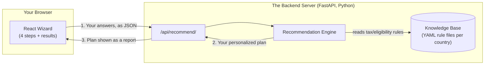
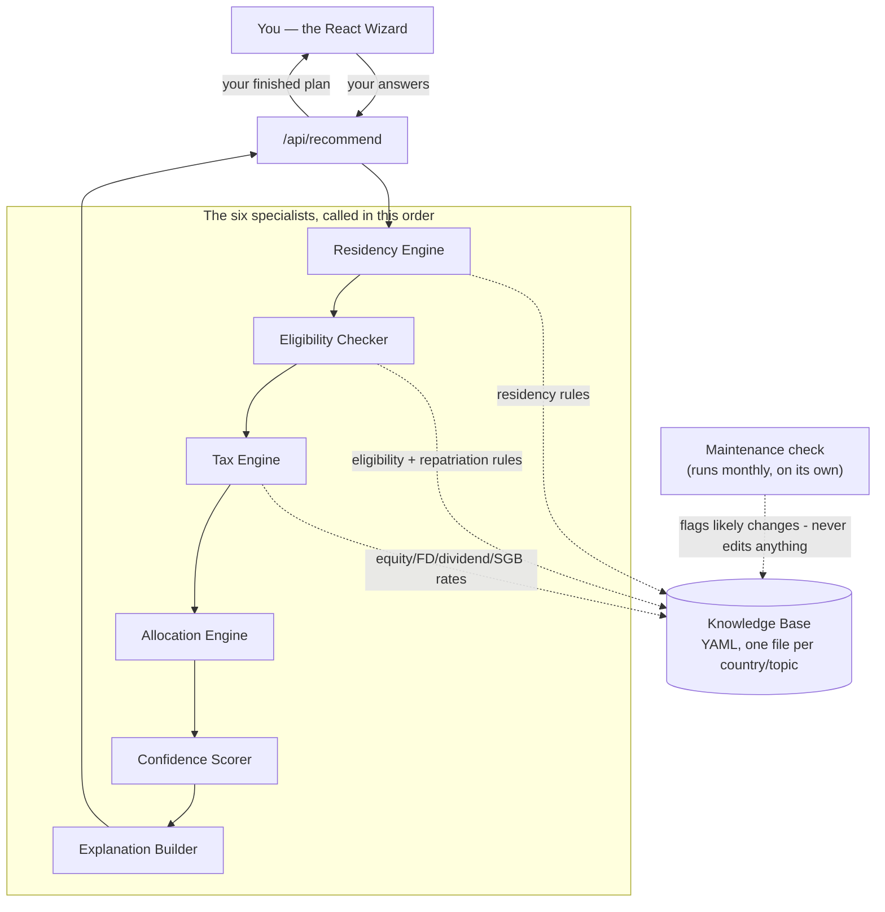
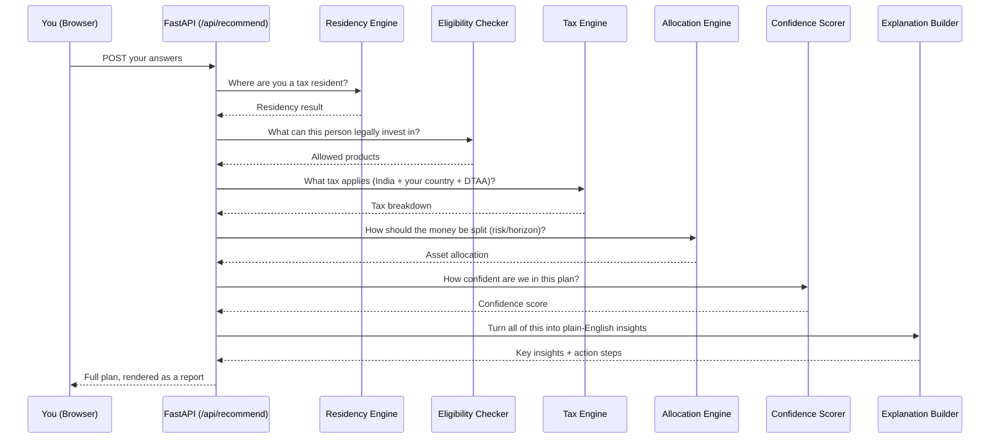
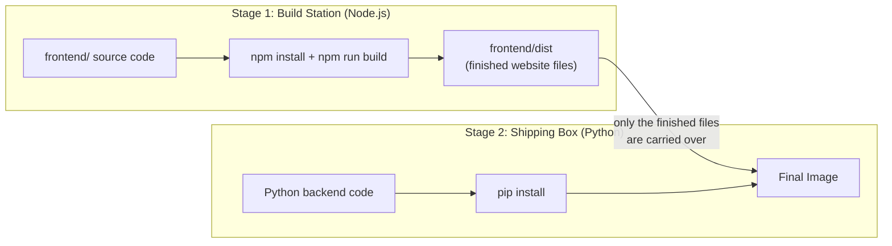
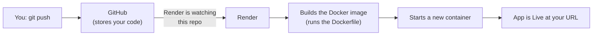

# How This App Works (Plain-Language Guide)

This explains, in simple terms, what this app actually does, what happens
when you click things, what "deploying to Render with Docker" actually
means, a couple of real bugs we found and fixed along the way, and — the
newest, still-in-progress piece — how the app is learning to look at your
*actual* mutual funds using real market data instead of a fixed list. No
prior background assumed; written so you could explain any of it to someone
else without notes.

## 1. What is this app, in one paragraph?

You answer a few questions about yourself (where you live, what you earn,
what you already hold in Indian investments, what your goals are). The app
runs those answers through a set of **fixed rules** — the same kind of rules
a tax advisor would follow from a manual — and hands back a personalized
investment/tax plan: how to split your money, which Indian investment
products you're actually allowed to use from your country, what tax you'd
owe in India and in your country of residence, and what to do next.

**Important:** there is no AI "thinking" happening inside this app. No
ChatGPT-style model decides your plan. It's closer to a very detailed
calculator/rulebook than to a chatbot. (The only place an AI model appears
anywhere in this whole project is your separate FamilyPlanner app — this app
doesn't use one at all.)

## 2. The big picture

Everything — the questions form *and* the server that answers it — is
shipped and run together as **one single app** once deployed. More on why
that matters in section 6.

## 3. The complete map — every component, and how it all ties together

*(as of 2026-08-27 — read this section if you want the whole picture in
one place; sections 6 onward tell the dated, blow-by-blow story of how we
got here, if you want the history instead)*

### The cast of characters

Think of it like a small clinic. You (the browser) walk in and hand your
paperwork to a receptionist (the API), who sends you to six specialists
in a fixed order, then hands you back one combined report. Nobody sees
you except the receptionist; the specialists never talk to each other
directly, only through the receptionist — this is the same relay
described back in section 2, just with all six specialists named instead
of grouped into one "Engine" box.

| Specialist (a file in `app/modules/`) | What it actually decides |
|---|---|
| **Residency Engine** | Are you tax-resident in India, "resident but not ordinarily resident," or a non-resident — from day-count rules |
| **Eligibility Checker** | Given your residency, what you can legally buy (mutual funds, FDs, SGBs, PPF...), and what's off-limits |
| **Tax Engine** | What tax you'd owe — in India, in your country of residence, and after any DTAA (double-tax treaty) relief |
| **Allocation Engine** | How your money should be split across equity/debt/gold/real estate/cash, based on your age, goal, and time horizon |
| **Confidence Scorer** | How much this specific plan should be trusted, given how complete your answers were |
| **Explanation Builder** | Turns everyone else's findings into the plain-English insights and action steps you actually read |

Two more things sit behind the specialists:

- **The Knowledge Base** (`app/knowledge_base/`) — a shelf of reference
  books, one YAML file per country/topic (India's tax rules, each of the
  8 residence countries' tax rules, DTAA treaties, account types, FEMA
  repatriation limits...). The idea from day one: specialists consult
  this shelf instead of memorizing facts themselves, so correcting a rule
  is "edit a book," not "retrain a specialist."
- **The Maintenance Crew** (new as of today, `scripts/` + a scheduled
  robot) — nobody was checking the shelf for outdated books on their own,
  so once a month an automated check now taps each book and says "this
  might be outdated, go look." It never edits anything itself — see the
  diagram below.

### Not every specialist actually reads the shelf yet

Here's what we found out today, the hard way: **saying** "specialists
consult the shelf" and **actually wiring every specialist to open the
book** turned out to be two different things.

| Specialist | Actually reads the Knowledge Base? |
|---|---|
| Residency Engine | **Yes, fully** — always has |
| Eligibility Checker | **Partly, as of today** — which instruments you can buy, country restrictions, and repatriation limits now come from the shelf. A couple of things (FATCA/FBAR-style compliance paperwork, live currency exchange rates) still don't, on purpose — explained below |
| Tax Engine | **Partly, as of today** — equity tax rates, FD interest TDS, dividend TDS, and Sovereign Gold Bond tax now come from the shelf. Debt fund, real estate, and gold tax rules still don't, because today's audit found the actual law here is genuinely unsettled — and guessing at unsettled law is exactly what this app is built never to do (same "a human decides, nothing guesses" principle from section 9, just applied to whoever edits the code, not just to AI) |
| Allocation Engine, Confidence Scorer | **No — and that's fine.** These aren't facts from a tax authority at all. "Shift 15% from equity to debt after age 55" is this app's own judgment call, not something a Finance Act changes. There was never a book for these to read, and there doesn't need to be one. |

Before today, *most* specialists were quietly working from memory
(numbers written directly into their own Python file) instead of the
shelf — which defeats the entire point of having a shelf. Two of those
memorized numbers turned out to be wrong, and neither one raised an
error — both just quietly gave a confident, wrong answer:

- **NRI FD interest TDS was memorized as 10%.** The real number is 30% —
  10% is what a *resident* Indian pays, not an NRI.
- **Sovereign Gold Bonds were memorized as "NRIs can buy these."** They
  can't — NRIs can keep SGBs they already owned before becoming an NRI,
  but can't subscribe to new ones. The shelf had this right all along;
  the specialist just wasn't reading it.

Both are fixed now. It's the same lesson as the "Failed to fetch" bug in
section 7 and the AMFI column-order surprise in section 9: something can
look fine until you actually check it against reality.

### The map, drawn out

### The supporting cast

A few more pieces that aren't part of the specialist chain but matter:

- **CAS Parser** (`app/api/cas_parser.py`) — reads your uploaded
  statement PDF: mutual funds, stocks, and (added recently) your life
  insurance cover.
- **AMFI + mfapi.in clients** — look up your specific funds' real
  identity and real historical returns. This is "Holdings Review, Phase
  A" from section 9 — built and verified live, but not yet connected to
  anything you can see on the results page (that's Phase B onward).
- **Gold price lookup, currency converter, disclaimer generator** —
  small utilities: a live gold price with a hardcoded fallback,
  INR/foreign-currency conversion, and the "this is educational, not
  professional advice" text on every response.

### Where things actually stand, in plain terms

- **Built and live**: the full wizard-to-plan flow, CAS upload
  (including insurance), both bugs above fixed, monthly automated checks
  on the Knowledge Base's freshness.
- **Half-finished, on purpose, and now clearly labeled instead of
  hidden**: the "specialists read the shelf" design is true for 2 of 6
  specialists so far (Residency fully; Eligibility and Tax partly). The
  rest either don't need it (Allocation, Confidence) or haven't been
  migrated yet (parts of Tax Engine).
- **In progress**: Holdings Review — Phase A (know your real funds) is
  done; Phase B (judge them against a benchmark) hasn't started.
- **Known, written-down gaps** rather than hidden ones: 3 of the 8
  residence countries' tax pages block automated checking (India found a
  workaround; Australia/Canada/Germany haven't yet); the other 8
  countries' tax rules have never been checked against real current law
  the way India's just was.

For the exact technical detail behind any of this — file names, test
counts, what's hardcoded where and why — `CLAUDE.md` and
`ARCHITECTURE.md` are kept current; this section is the plain-English map
to keep in your head between visits.

## 4. Walking through what you actually experience

1. **Step 1 — Residency**: where you live now, your Indian residency status.
2. **Step 2 — Assets**: what you already hold (you can upload a CAS PDF —
   the statement your Indian depository sends — and the app tries to
   auto-read your mutual funds/stocks from it, or you type them in by hand).
3. **Step 3 — Goals**: what you're investing for and your risk appetite.
4. **Step 4 — Review**: a summary before you submit.
5. **Results**: the server crunches everything and shows your plan —
   how to allocate your money, specific products, expected tax treatment,
   and a written explanation of why.

## 5. What happens the instant you click "Get my plan"

Each of those boxes (Residency Engine, Eligibility Checker, Tax Engine, ...)
is just a Python file with rules in it — see `app/modules/`. They read their
actual numbers (tax rates, contribution limits, DTAA provisions) from plain
YAML files in `app/knowledge_base/`, organized one folder per country. If a
tax rate changes next year, someone edits a YAML file — no code change needed.

## 6. The deployment story: Render, Docker, and why they matter

This is the part that's new. Here's every term you've seen, explained with
an analogy.

### What is "hosting" / a server?

Your laptop can run this app (`uvicorn main:app`), but only while your
laptop is on and connected. To have the app reachable by *anyone, anytime*,
it needs to run on a computer that's always on, owned by a company whose
whole job is keeping computers running — that's "hosting."

### What is Render?

**Render is the landlord.** You don't buy or maintain a physical server —
you hand Render your code, and Render rents you a slice of one of their
always-on computers to run it on. `render.yaml` is the move-in form: it
tells Render exactly how to build and start your app.

### What is Docker, and what is a "container"?

**Docker is a shipping container for software.** A shipping container works
the same whether it's on a truck, a ship, or a train — because everything
needed is sealed inside it. Docker does the same for an app: it packs your
code *plus* the exact versions of Python, Node, and every library it needs
into one sealed box (called an **image**). That image can then run
identically on your laptop, on Render, or anywhere else — no more "works on
my machine" surprises.

- **Dockerfile** = the packing instructions (a text file listing exactly
  what goes in the box and in what order).
- **Image** = the sealed, built box — a snapshot, not yet running.
- **Container** = an image that's actually been switched on and is running.

### Why does our `Dockerfile` have two stages?

Think of it like a workshop with two rooms. Room 1 has all the carpentry
tools (Node.js) needed to build a cabinet (the finished frontend files).
Once the cabinet is built, you carry *just the cabinet* into Room 2 (the
lean Python room) and throw away all the sawdust and tools. The final
shipped box never needs Node.js installed in it at all — only the finished
product. This keeps the final image smaller and simpler.

*(Why we needed this at all: Render's plain Python hosting option doesn't
come with Node.js pre-installed, and this app's frontend needs Node to
build. Docker lets us bring our own Node just for the build step, then
discard it.)*

### What does "single origin" mean?

Before this, the frontend (the wizard) and backend (the API) could
potentially live at two different web addresses, needing extra
configuration (CORS) to let them talk to each other safely.
**Single origin** means both live at the *same* address —
`https://indian-investment-app.onrender.com/` serves the wizard, and
`https://indian-investment-app.onrender.com/api/recommend` serves the API,
from the exact same running app. One address, one thing to manage.

### What happens when you `git push`?

`git push` only updates GitHub — it's Render's job to *notice* that and
react. Because we used a Render "Blueprint" (`render.yaml`), Render watches
this repo automatically: every future push to `main` triggers a fresh
build and redeploy on its own, with no manual button-click required.

### Quick glossary

| Term | Plain-English meaning |
|---|---|
| **Render** | The hosting company running your app on their servers |
| **Blueprint** | Render's name for "a deployment configured by a `render.yaml` file" |
| **Docker** | The tool that packages your app into a portable, sealed box |
| **Dockerfile** | The recipe/instructions for building that box |
| **Image** | The built, sealed box (not running yet) |
| **Container** | An image that's switched on and running |
| **Build stage** | A temporary room used only to prepare something, then discarded |
| **Single origin** | Frontend and backend served from the same web address |
| **CORS** | A browser security rule about which websites can talk to which APIs — mainly matters when frontend and backend are *not* single-origin |
| **Environment variable** (e.g. `PORT`, `DEBUG`) | A setting handed to the app from outside its code, so the same code can behave differently in different places without editing it |
| **Health check** | Render periodically asking "are you still alive and working?" — if the app stops answering, Render knows something's wrong |
| **Cold start** | On Render's free plan, the app goes to sleep after 15 minutes of no visitors, and takes a moment to wake up on the next visit |

## 7. A detective story: the bug that only broke for strangers

Right after the first real deploy, something strange happened: uploading a
statement worked fine when we tried it, but failed for anyone else visiting
the site, with an error saying "Failed to fetch."

Here's what was actually going on, with no jargon: the website's button was
built with an address baked into it — like a sticky note on a phone that
says "always call this exact number." While the app was being built on a
developer's own laptop, that number happened to be *the developer's own
laptop* — so it worked. But once the app went live for real visitors, that
same sticky note still said "call the developer's laptop," which makes no
sense for anyone else — their computer has no idea what that means, so the
call just fails silently.

The fix wasn't to change the phone number — it was to remove the sticky
note entirely and replace it with an instruction: "call whoever's house this
message is already sitting in." Now, whether you open the site on your
laptop, your phone, or anyone else's device, the button correctly calls
*that visitor's own copy of the app*, not a specific hardcoded computer.

The lesson worth keeping: something can work perfectly when *you* test it
and still be completely broken for everyone else, because your own test
might be accidentally special (e.g. things happening to be on the same
machine) in a way real visitors' situations aren't. That's why we always
tested with a real second visitor's-eye view — an incognito browser window,
with zero memory of anything from before — rather than trusting "it worked
when I tried it."

## 8. Teaching the app about your life insurance

Small addition, same day: your real CAS statement turned out to include a
life insurance summary (policy count + total cover amount), not just
mutual funds and stocks. Two things happened:

1. The app learned to *read* that section from the PDF (it was being
   ignored entirely before).
2. A field for it already secretly existed in the app's data model
   (`insurance_sum_assured_inr`) — built at some earlier point, but nothing
   ever filled it in or looked at it. It was a labeled shelf with nothing on
   it. We filled the shelf, and taught the recommendation logic to actually
   check it: compare your cover against a common rule of thumb (roughly 10x
   your annual income) and say something if it looks low, or flag it
   entirely if there's no cover at all.

Small on its own, but a good example of a pattern worth naming: **software
projects often have unused pieces sitting around** — a field, a function, a
setting — built for a reason that got lost or deferred. Part of good
maintenance is periodically asking "is this shelf actually being used?"

## 9. Teaching the app to know your funds for real

This was the bigger project today, and it's not finished yet — this section
explains what we built and, just as importantly, *why*, so tomorrow's
continuation (Phase B) makes sense.

### The problem we're solving

Until today, when the app suggested "here are some mutual funds to
consider," it was picking from a **fixed, mostly-illustrative list of about
a dozen funds** written directly into the code — the same list for every
single person, regardless of what they actually own, and not connected to
any real, current market data. It's the equivalent of a restaurant handing
every customer the exact same laminated menu regardless of what's actually
in the kitchen that day.

What we actually want: look at the funds *you* specifically already own,
and say something real about them — using real, current numbers, not a
fixed script.

### The three-piece puzzle: identity, history, and judgment

To say anything real about one of your specific funds, the app needs three
separate things, and — this is the part worth understanding — **we
deliberately used a different tool for each one**, rather than one tool
trying to do everything:

```mermaid
flowchart LR
    CAS["Your CAS statement\n(uploaded PDF)"] -- "extracts" --> ISIN["A fund's ISIN\n(its unique ID number)"]
    ISIN -- "1. Who exactly is this fund?" --> AMFI["AMFI\n(India's official mutual fund registry)"]
    AMFI -- "hands back a scheme code" --> MFAPI["mfapi.in\n(a free history-keeping service)"]
    MFAPI -- "2. How has it performed\nover the last 1/3/5 years?" --> Numbers["Real return numbers"]
    Numbers -- "3. Judged against simple rules" --> Verdict["Aligned / Worth reviewing /\nToo concentrated / etc."]
```

**Why not just search by fund name?** Because names extracted from a PDF
are messy — your statement literally shows fund names getting cut off
mid-word ("Aditya Birla Sun" with no indication of *which* Aditya Birla Sun
fund). Guessing from a half-cut name is unreliable. So instead, every fund
has an **ISIN** — think of it like a fingerprint or a passport number for
that exact fund, no ambiguity possible. Two funds can have very similar
names; they can never have the same ISIN. That's why the very first fix
today was making sure the ISIN wasn't accidentally being thrown away while
reading your PDF (it was! — the code was reading it, then discarding it
without saving it, a genuine bug fixed today).

**What is AMFI, in plain terms?** AMFI (Association of Mutual Funds in
India) is the official, free, public record book for every mutual fund
scheme in India — think of it as a national phone book. Hand it a
fingerprint (ISIN), and it tells you: which fund this actually is, its
official name, and today's price per unit (its "NAV").

**What is mfapi.in, and why do we need a second service at all?** AMFI's
phone book tells you *who* a fund is *today* — it doesn't keep a history
book of prices going back years. For that, we use a free public service
called mfapi.in, which happens to use the *exact same* ID numbers as AMFI
(confirmed for real today, not assumed) — so once AMFI tells us "this is
scheme #100474," we hand that same number to mfapi.in and ask "show me its
price history," which lets us calculate how much it actually grew over the
last 1, 3, and 5 years.

**What does "trailing return" actually mean?** If a fund's price was ₹50
three years ago and is ₹100 today, it roughly doubled — but "doubled over 3
years" isn't a single yearly number you can compare across funds. So we
convert it into "if this grew at a *steady* rate every year, what would
that yearly rate have to be?" — that steady-yearly-rate number is the
"trailing return" (technically called CAGR). It's just a fair, comparable
way to describe growth over different time periods.

### The most important design decision: rules decide, AI only explains

This matters enough to say plainly, since eventually (tomorrow or later)
an AI model gets added to this feature: **the AI will never be the one
deciding whether a fund looks good or bad.** That decision — "this fund's
return looks low for its category," "this is too large a slice of your
money in one place" — will always come from a fixed, readable rule, exactly
like the tax rules already in this app. The AI's only job, later, will be
turning an already-decided verdict into a well-written sentence — the way a
translator explains a decision, without being the one who made it.

Why this matters: an AI model can occasionally state something confidently
that isn't true (this is a well-known limitation, not a flaw specific to
this project). For something touching real money, that's an unacceptable
risk *for the decision itself* — but perfectly fine for polishing how a
decision is *phrased*, as long as it's never allowed to invent the decision
too. This split is also why this stays honest to explain to anyone: "the
computer's fixed rules decided this; a language model just wrote it up
nicely" is a sentence you can say with a straight face.

### What we actually finished today vs. what's still ahead

Today (**Phase A**, in the plan): the "identity" and "history" pieces above
— proven to work against your real fund, live, on the real deployed app.
Nothing about this is visible on the website yet; it's plumbing underneath.

Tomorrow (**Phase B**): the actual judgment rules (comparing your fund's
real return against a benchmark, flagging over-concentration) — still no
AI involved, fully rule-based and testable, and the first point where this
becomes something you could actually see working end-to-end.

Later (**Phase C and D**): the AI narration layer, and an actual button on
the results page to try it.

## 10. A bigger lesson for the journey: how real software actually gets built

A few habits showed up repeatedly today that are worth naming explicitly,
since they apply far beyond this one app:

- **Break big goals into small, checkable pieces ("phases").** "Make
  recommendations use real data and AI" is too big a thing to build in one
  go and trust blindly. Splitting it into A (data plumbing) → B (judgment
  rules) → C (AI writing) → D (the button you actually click) means each
  piece can be tested and trusted before the next one leans on it.
- **Pause at natural checkpoints, on purpose.** After Phase A, we stopped
  and actually verified it against your real data before writing a single
  line of Phase B — because Phase B would have been built on top of
  assumptions we hadn't actually confirmed yet.
- **Test against the real world, not just your best guess.** The plan
  assumed one file format for AMFI's data, based on research. The *real*
  live file turned out to have a different column order. If we'd trusted
  the assumption and moved straight to Phase B, every single number shown
  to you would have been wrong — quietly, with no error message, since
  wrong-column-math still produces *a* number, just the wrong one. The only
  way this got caught was by deliberately checking a real, live answer
  before trusting the code.
- **When something breaks, ask *why*, not just *how do I make the error go
  away*.** The "Failed to fetch" bug (section 7) could have been
  papered over in a dozen shallow ways. Understanding *why* it only
  happened for other people, not for us, is what led to an actual fix
  instead of a lucky patch.

If you take one thing from today into your own learning: a professional
approach to building something isn't about writing perfect code on the
first try — it's about building in small enough pieces that you can catch
your own wrong assumptions early, cheaply, and with real evidence instead
of guesswork.

## 11. Where things stand

See `CLAUDE.md` for the always-current technical status (test counts, what's
built, what's still open). This document explains the *why* and *how* in
plain language; `CLAUDE.md` and `ARCHITECTURE.md` carry the precise,
up-to-date technical facts.
